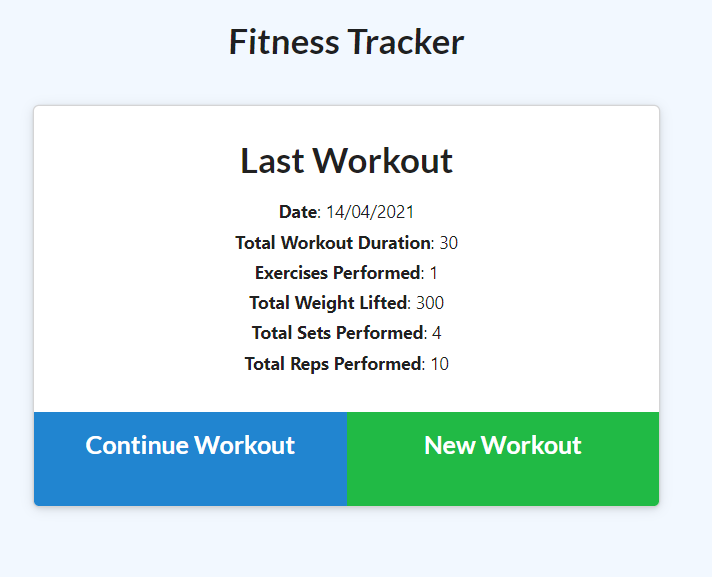
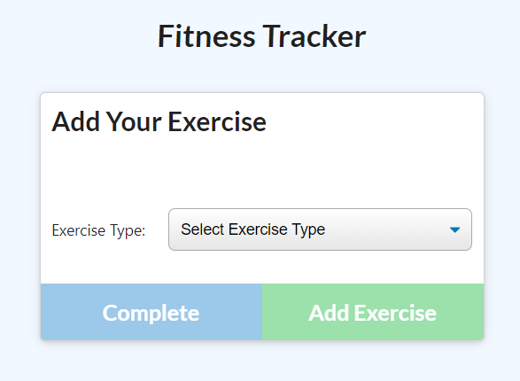
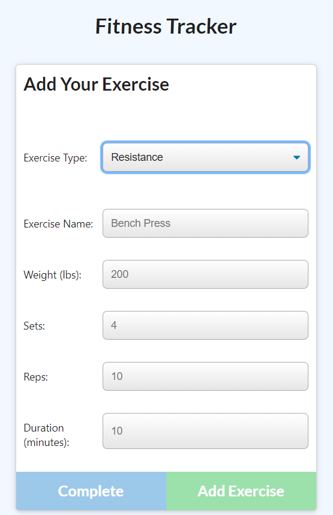
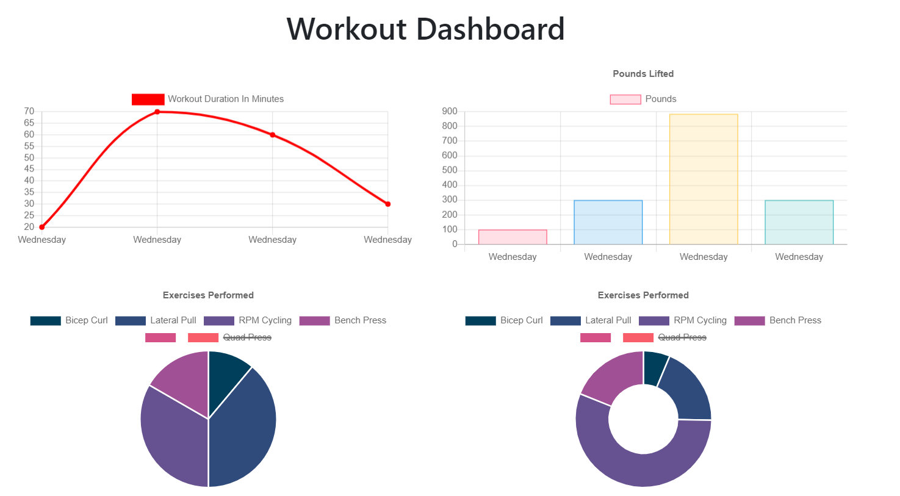

# Fitness-Tracker-Application

  

  ## Description 
  
  This application is a Fitness-Tracker-Application deployed in the cloud using Heroku.

  With the given front-end code, I formulated the backend using express, mongoose (Object Data Modelling for MongoDB and NodeJS).I created a Mongo database with a Mongoose schema and handle routes with Express.
  
  
  ## Table of Contents
  
  * [Installation](#installation)
  * [Usage](#usage)
  * [License](#license)
  * [Contributing](#contributing)
  * [Tests](#tests)
  * [Questions](#questions)
  
  
  ## Installation
  
  The project requires that express and mongoose be installed in the local machine. A seed.js file was used to populate the database with nine instance of exercises array.

  Nodemon was also installed as development dependency.
  
  
  ## Usage 
  
  The following image snapshots the functionality of the app.

  

  

  

  

  
  The application could be accessed using the following heroku link:

  https://apolinar1607/Workout-Tracker

  The repository for this application could be accessed using the following github link:

  https://am-fitness-tracker1.herokuapp.com/

  
  
  ## License
  
  Licensed by : [Apache](./utils/license-Apache)
  
  
  ## Contributing
  
  Not applicable.
  
  ## Tests

  To run the application locally, type 'npm run watch' or 'npm start' in the command line inside the folder containing the server.js file.
  
  To deploy it automatically, use the heroku link provided above.

  ## Questions
  
  Github Username: 
  [apolinar1607](https://github.com/apolinar1607)

  Please send me an email if you have any question(s): 
  apolinar.magtanong@gmail.com
  
  

  ---
  © 2021 JM Automation . All Rights Reserved.

